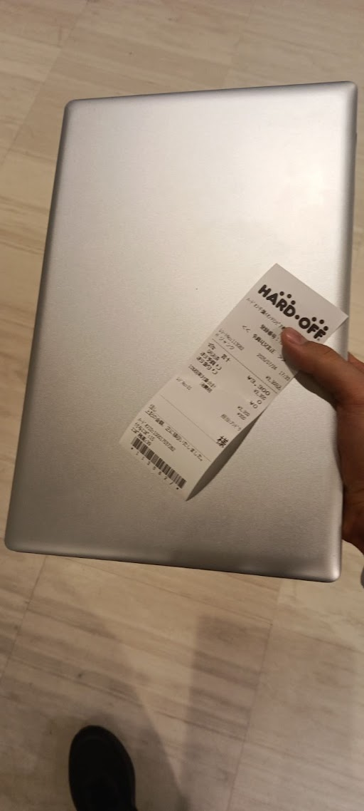
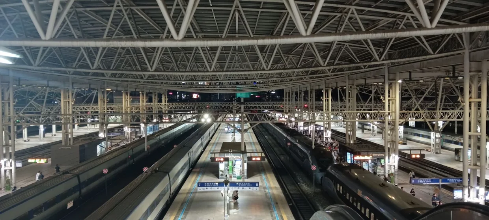
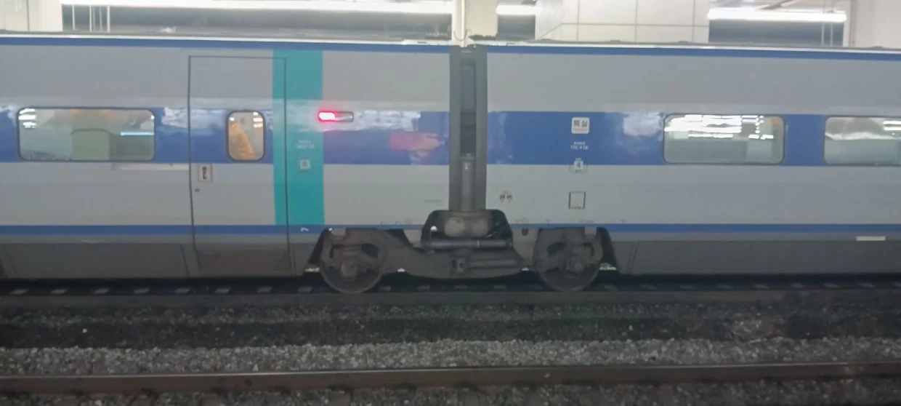
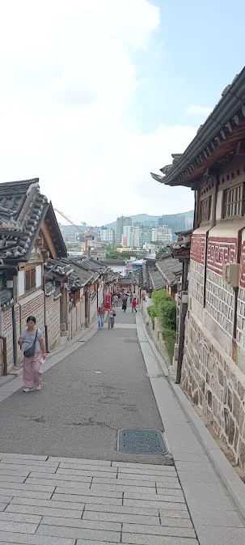
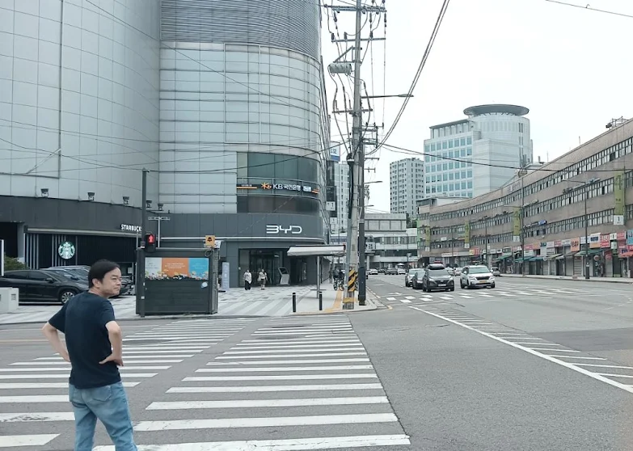
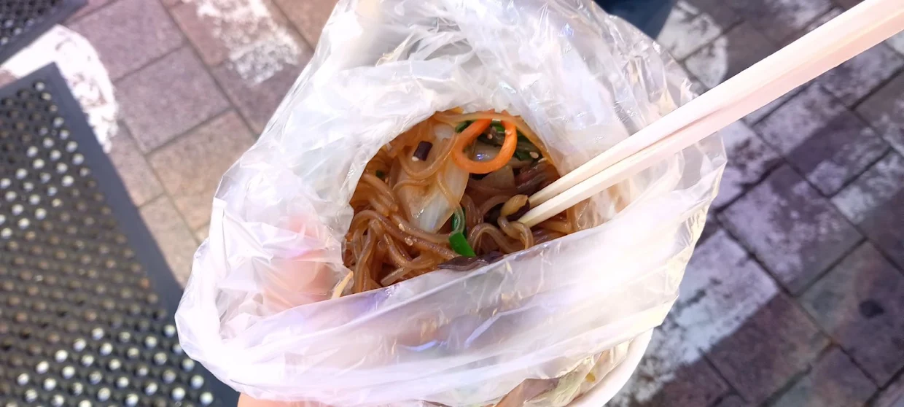
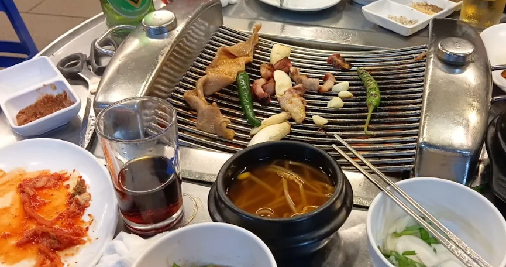
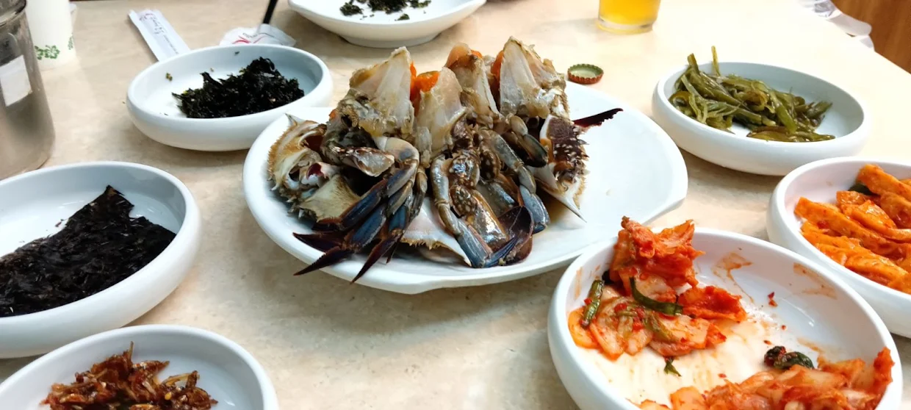
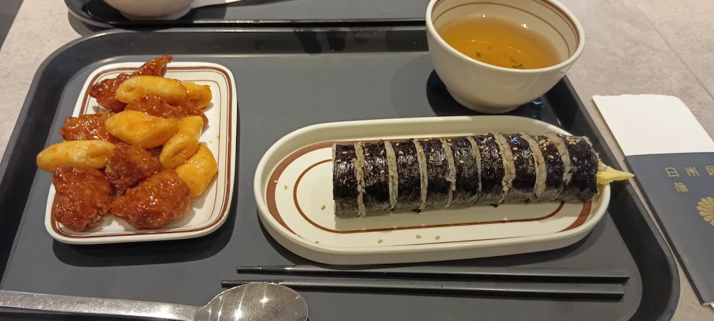

# My Blog

## 2026/07/15

* 今日、人生初のJOIの申し込み完了。

* そして学校の数学のテストの点数が悪い。上位クラス落ちるかも?

## 2026/07/16

* 東進の公開授業に行ってきます。

* CHSのリポジトリをある程度完成させたら、そこからは、ファイルを投げるシステムを作る予定(仮)

## 2026/07/16

* 大岩先生の授業すごかった。相当量の内容を頭に詰め込まれた感じがして予備校もいいなと思った自分。

## 2026/07/20

* 夏休み突入。

* なかなかサバイバルな韓国旅行。龍山電子商街にも行って来た。ほとんど閉店していたが。
韓国製ハングルキーボードがお土産に。
画像また上げます。

## 2026/07/20

* パソコン買いました。もちろんハドフのジャンク。

### 韓国の写真
* 大陸の列車たち




* シャッター街…



* ご飯
とうもろこしは餅のようで口に合わない。


## 2026/07/24

* C言語ユーザーとしてC++に手を出してみた。g++って**コンパイル速度遅いな**!!
Cの関数が普通に使えて**互換性**が神。もし本格的に使うなら、そこのつながりを意識して学ばないと…

以下、初めて書いたハローワールドの出力。
```cpp

#include <iostream>

int main (void){
	printf("Hello world!\n");
	std::cout<<"Hello world!\n";
	puts("こんにちは");
	return 0;
}

```

## 2026/08/07

一晩風呂キャンしてしまった...
ちなみに吹奏楽コンクールは銅賞で予選敗退です。[結果](銅賞.pdf)

## 2026/08/07

競技プログラミングを少しかじった。普通に難しい。プログラミングをやめたくなる。

## 2026/08/19

* 図書館で本を借りてC++を学び始めた。Cの知識のおかげでスラスラ読める。C++で追加された機能の差分を学ぶだけである程度使える!?

* 一応この際行っておくとこのリポジトリは完全フリーにしています。
(現時点では・オープンソース主義者なので変える気もないですが。・誰もこんなユーザーのクソコードなんて参考にしないと思いますが。)

* あと今更gitコマンドでsshを使ってgithubにpush。
ghみたいな一つのサービスに依存するコマンドは正直好きではないのでsshが使えてよかった。今までアクセストークン使ってた時間を返せ!!(技術を学ばなかった自分の自業自得。)

## 2026/08/20

* 映画ちいかわを見てきた。

原作の雰囲気的にも噂的にも重いと言われていたが相当に重い。
序盤は1つの側面からの情報が映し出されていたから、「正義」が固まっていたが、カレーを食べさせたシーンあたりから、それが崩れてどんどん重くなっていく。
エンドロール後の1カットなんなんだ。

* **LINE**(といえば設計思想的に私が心底嫌っている**クソアプr**(以下略))のユーザー名をALLにしてみた。
(以前は本名をhex変換したものだったなぁ...)

というのも、グループラインで@ALLでメンションされたのがきっかけ。「これ、ユーザー名*ALL*にしたらバグるんじゃね?」
で、*ALL*に変更。

結果:*@ALL*でメンションされたとき、自分だけ**仲間はずれに**。

データーベース上では、@ALLとユーザー名ALLが区別されていて、クライアント側での処理がうまく行っていない模様。
やっぱ**LINEはクソアプリ!**

## 2026/08/20
* LINEの名前、正しくは@Allでした。そっちの方でやってみている。
* ADBコマンドをあんしんフィルターの中ゴリ押しでなんとか制限突破できた。以下、制限下でのうまいやり方。

    * ```about:blank```など、連打しても反応しない環境を開く。

    * ケーブルをスマホに挿す。

    * そこから画面の右下部分(1,2回やればわかります。)を連打。あんしんフィルター画面にリダイレクトされるまでの一瞬を狙う。

    * 上手く押せずリダイレクトされてしまうことが多いため、何回もトライする。1度接続したあと、再接続するときは少し時間を置くと良。
 
    * あんしんフィルターを止めるコマンド(ググれks)でkill!

    * FREEDOM!!!!!

時間制限させられてる深夜に、開けないはずのyoutubeアプリ開けて最高。

## 2026/08/22

千葉市は全国の中で最低経費で最も多くのふるさと納税寄付を集めた自治体らしい。
市内在住・個人からの寄付が要因の1つらしいが、誰?????(宇宙に行った前澤友作とか?)

あと来年以降はもう一回寄付してれない限りランク落ちること確定...

返礼品はコストコ商品券とかうちの学校への寄付らしいが...

## 2026/08/24
* 再び競技プログラミングの問題実践(コンテストは難しすぎたので練習を積む。)

C++の勉強用ファイルとも相まって若干プログラミング用にリポジトリを分けたくなっている。
